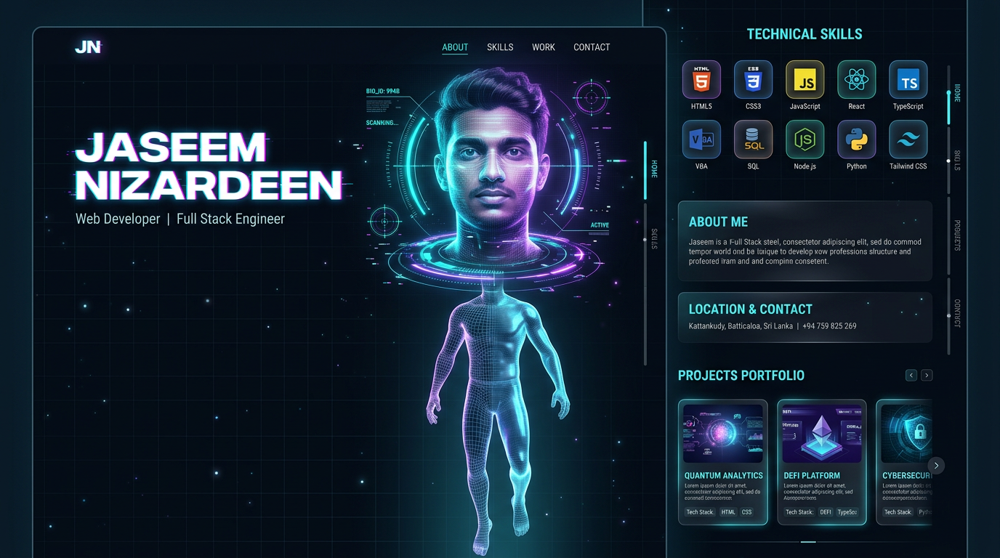

# JASEEM NIZARDEEN — 3D Holographic Portfolio

A hi-tech, scroll-driven **Three.js** personal profile site. A holographic 3D avatar of
**Jaseem Nizardeen** starts as a floating **head + name**, and as you scroll the camera
travels **head → chest → legs** before transitioning into the Skills / About / Contact
sections.



## Run it

```bash
npm install
npm run dev      # dev server → http://localhost:5173
npm run build    # production build into dist/
npm run preview  # preview the production build
```

The dev server binds to `0.0.0.0` so it works in hosted preview environments.

## Put your real face in it

The avatar's face is projected from a single image:

1. Replace **`public/me.jpg`** with a **clear, front-facing selfie** of you
   (head centered, evenly lit, portrait or square is best).
2. Reload the page — no other changes needed. The code auto-fits the photo
   aspect ratio and hologram-izes it (scanlines, cyan tint, edge dissolve).

If `me.jpg` is missing the site falls back to a generated "JN" monogram card,
so it never breaks.

## How the scroll works

| Progress | What happens |
|----------|--------------|
| 0 – 0.16 | **Hero** — camera on the face, HUD rings + reticle + data chips, glitch name |
| 0.16 – 0.42 | **Body scan** — camera travels down, holographic dissolve reveals head → legs |
| 0.42 – 0.72 | **Skills** — avatar drifts left, skills matrix appears on the right |
| 0.70 – 0.88 | **About** — location: Kattankudy 01, Batticaloa, Sri Lanka |
| 0.86 – 1.0 | **Contact** — call / WhatsApp buttons |

## Stack

- **Three.js** (WebGL + `UnrealBloomPass` post-processing)
- **Vite** (dev server + build)
- Custom GLSL shaders (holographic fresnel + scanline dissolve)
- Vanilla JS scroll engine (lerped camera, no heavy animation libs)

## Details

- 👤 Jaseem Nizardeen — Web Developer
- 🛠️ HTML · CSS · JavaScript · React · TypeScript · VBA · SQL
- 📍 Kattankudy 01, Batticaloa, Sri Lanka
- 📞 +94 75 982 5269
